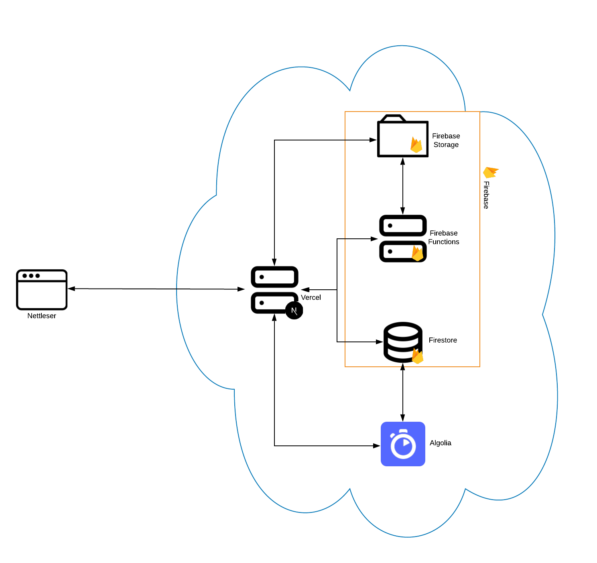

# readme-arkiv-v2
Artikkel og utgavedatabase for studentmagasinet [readme](https://readme.abakus.no/).


Dette er et [Next.js](https://nextjs.org/)-prosjekt satt opp med [`create-next-app`](https://github.com/vercel/next.js/tree/canary/packages/create-next-app) og [Firebase](https://firebase.google.com/).

Dette er en videreutvikling av det [gamle arkivet](https://github.com/readme-ntnu/readme-arkiv), som var byget som en ren React-app.

## Kom igang

Først, sørg for at du har [Node](https://nodejs.org) og [Yarn](https://yarnpkg.com) installert.

Klon deretter repoet og kjør følgende kommandoer

```bash
git clone git@github.com:readme-ntnu/readme-arkiv.git
cd readme-arkiv
yarn 
cd functions
yarn 
```

Så må du installere firebase-tools:
```bash
npm install -g firebase-tools
```

Du trenger også en fil med lokale miljøvariabler, som lar deg kjøre prosjektet. Spør [Andreas Hammer Håversen](https://github.com/AndreasHaaversen), så sender han deg en fil.
NB! Denne fila, som _må_ hete `.env.local`, _*må*_ holdes hemmelig, da den inneholder sensitiv info.

NB! For å kjøre firebase-emulatorer trenger du også java installert.

Åpne to terminaler. I den ene starter du Firebase-emulatorene ved å skrive:
```bash
yarn emulators
```
I den andre starter du Next-serveren ved å skrive:
```bash
yarn dev
```


Du kan nå åpne nettsiden på [http://localhost:3000](http://localhost:3000).

Det er satt opp Firebase-emulatorer for Functions, Firestore, Storage og Auth, og laste inn testdata i de tre siste.  Emulatorene kan styres/justeres/inspiseres fra localhost:4000. Auth-emulatoren lastes inn med en testbruker som har e-post andreas.h.haaversen@gmail.com og passord password. Bruk denne om du vil se admin-sidene (localhost:3000/admin).

## Deploy
Dette er ikke satt opp enda, info kommer!

## Oversikt over systemet og dets funksjoner
(*OBS*: Dette er masse nerde-detaljer)

`readme` sitt arkiv består av tre deler: Next.js frontend-en, Firebase backend-en, og artikkelsøk i Algolia. Bildet under gir et oversiktsbilde.




Vi tar de i tur og orden.

### Next.js frontend
Denne er satt opp med mest mulig Static Site Generation (SSG). Dette betyr at HTML-en til nettsidene generes når vi bygger applikasjonen, isteden for hver gang nettsidene åpnes. Det vil si at innholdet de fleste sidene, viktigst av alt forsiden, kun oppdateres når vi ber Vercel om å bygge nettsiden på nytt. Dette gjør at nettsidene laster kjapt, siden de kan forhåndslagres i sin helhet i CDN-et. 

#### Hendelser som utløser nytt bygg:
* Opplasting av en ny utgave
* Sletting av en utgave
* Erstatting av en utgave (egentlig samme operasjon som opplasting)

### Firebase backend
Her har vi fire forskjellige biter:

**Functions:** Dette er den delen av backend-en som gjør beregninger for oss. I dette prosjektet har vi en fuksjon som lager en JPEG-thumbnail for oss hver gang noen laster opp en ny utgave. Denne funksjonen utløser også et nytt bygg av nettsiden.

**Storage:** Dette er hvor vi faktisk lagrer selve utgave-PDF-ene og de tilhørende JPEG-thumbnail-ene. Det har en mappestruktur som ser slik ut: `{pdf/images}/{<<year>>}/{<<year>>}-{<<edition>>}.{pdf,jpg}`. Filbanen for PDF-en til utgave 01 i 2021 er da `pdf/2021/2021-01.pdf`, mens tilsvarende for thumbnail-en er `images/2021/2021-01.jpg`.


**Firestore:** Dette er hvor artiklene i hver utgave lagres. Hver rad i samlingen `articles` har oppsett som under. Merk at feltene kan være tomme, avhengig av typen artikkel.

| Feltnavn | Datatype        | Betydning                                                      | Eksempel                                                                            |
| -------- | --------------- | -------------------------------------------------------------- | ----------------------------------------------------------------------------------- |
| author   | tekst           | Hvem som har skrevet artikkelen                                | "Tobias Skjelvik"                                                                   |
| content  | tekst           | Det faktiske teksten i artikkelen                              | "readme er et veldig kult magasin..."                                               |
| edition  | tekst           | Utgavenummer, på formen `{utgaveår}-0{utgavenummer}`           | "2023-01"                                                                           |
| layout   | tekst           | Hvem som har hatt layout på artikkelen                         | "Øyvind Monsen"                                                                     |
| pages    | liste med tall  | hvilke sider artikkelen er på iht. utgaveplanen                | [8, 9]                                                                              |
| photo    | tekst           | Hvem som har tatt bilder til artikkelen                        | "Simen Holmestad"                                                                   |
| tags     | liste med tekst | Stikkord som beksriver innholdet i artikkelen. Brukes til søk. | ["kake", "korona", "fest"]                                                          |
| title    | tekst           | Artikkeloverskriften                                           | "Arrkoms korona-party: Hva er greia?"                                               |
| type     | tekst           | Hvilken spalte artikkelen utkom i                              | "Gløsløken"                                                                         |
| url      | tekst/lenke     | Lenke til pdf-en som artikkelen er i, med "page hash"          | https://storage.googleapis.com/readme-arkiv.appspot.com/pdf/2021/2021-03.pdf#page=5 |

Det finnes også en samling som heter `settings`. Denne har ett dokument som styrer litt hemmelig funksjonalitet i admin-siden.

**Auth:** Vi bruker Firebase Auth til å sikre autorisert tilgang til admin-funksjonene i arkivet, slik at utenforstående ikke kan tukle med utgavene og artiklene.

**Extensions:** Vi har en extension i produksjonsmiljøet som synkroniserer artikklene i Firestore med søket vårt i Algolia. Mer om søket litt lengre ned i readme-en.


### Algolia-søk
Vi bruker [Algolia](https://www.algolia.com/) for å drive søket på nettsiden. Indeksen der er synkronisert med Firestore-databasen, og gjør alle feltene utenom URL-en søkbare. Dette gir oss et fulltekst-søk med fuzzy matching.

## Tilganger
For å gjøre endringer i produksjonskonfigurasjonen til Firebase, Vercel, eller Algolia, må du få tilgang av en som allerede har det. Ta kontakt med [Øyvind](https://github.com/Oyveloper), [Andreas](https://github.com/AndreasHaaversen), eller [Mats](https://github.com/draperunner).